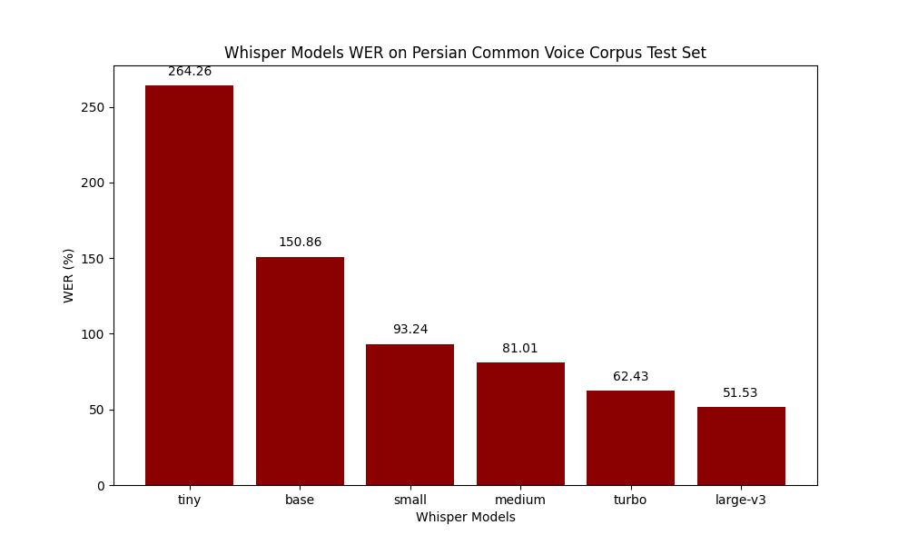

# Whisper Model Evaluation on Persian Language  

This repository contains the results of evaluating Whisper model variations on the Persian language using the **Common Voice Corpus 19.0 - Persian** dataset.

## Dataset Details  

We utilized the **train**, **dev**, and **test** partitions of the Common Voice Corpus 19.0 - Persian dataset.

### Dataset Sizes  

The dataset sizes, expressed as the number of files, are summarized below:

| Partition | Number of Files Before Filtering | 
|-----------|-----------------------------------| 
| Train     | 29,175                           |
| Dev       | 9,687                            |
| Test      | 10,404                           |

### Dataset Statistics  

Statistics regarding the lengths of audio files in each partition are as follows:  

| Partition | Min Length (s) | Max Length (s) | Average Length (s) |  
|-----------|----------------|----------------|---------------------|  
| Train     | 0.97           | 10.42          | 3.83               |  
| Dev       | 0.99           | 10.42          | 4.28               |  
| Test      | 1.40           | 24.86          | 4.94               |  

## JSON Files  

The dataset's TSV files were converted into JSON files for easier processing. The following files are included:  

- `cv-corpus-19.0-2024-09-13-fa-train.json`  
- `cv-corpus-19.0-2024-09-13-fa-dev.json`  
- `cv-corpus-19.0-2024-09-13-fa-test.json`  

These files are generated from the filtered dataset and contain metadata about the audio files.

# Whisper Models Performance on Persian Common Voice Corpus

This section presents the evaluation of Whisper models on the Persian Common Voice Corpus 19.0, using Word Error Rate (WER) as the metric across the train, dev, and test sets. The models vary in size, from the "tiny" model to the "large-v3," with results showing the trade-offs between model size, VRAM usage, and WER.

### Model Performance Summary

| Model       | Parameters | Required VRAM | WER % (Train) | WER % (Dev) | WER % (Test) |
|-------------|------------|---------------|---------------|-------------|--------------|
| **tiny**    | 39 M       | ~1 GB         | 248.92        | 164.76      | 264.26       |
| **base**    | 74 M       | ~1 GB         | 134.43        | 116.27      | 150.86       |
| **small**   | 244 M      | ~2 GB         | 78.12         | 93.69       | 93.24        |
| **medium**  | 769 M      | ~5 GB         | 55.72         | 87.01       | 81.01        |
| **turbo**   | 809 M      | ~6 GB         | 38.75         | 79.37       | 62.43        |
| **large-v3**| 1550 M     | ~10 GB        | 33.29         | 76.12       | 51.53        |

*Table 1: WER performance of Whisper models on the Persian Common Voice Corpus.*

### WER Comparison Plot

Below is the plot showing the WER comparison for different models on the test dataset:

